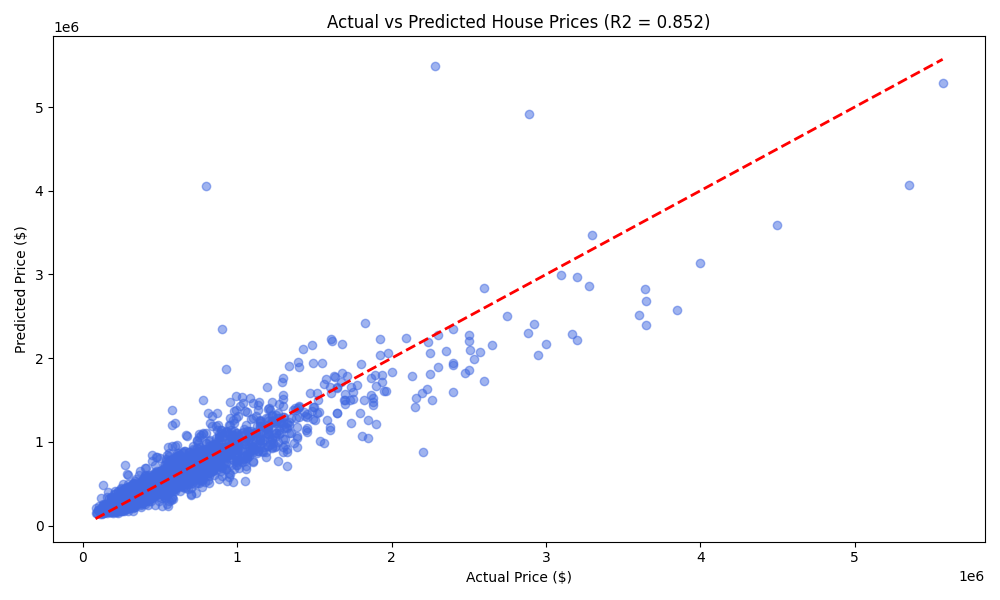
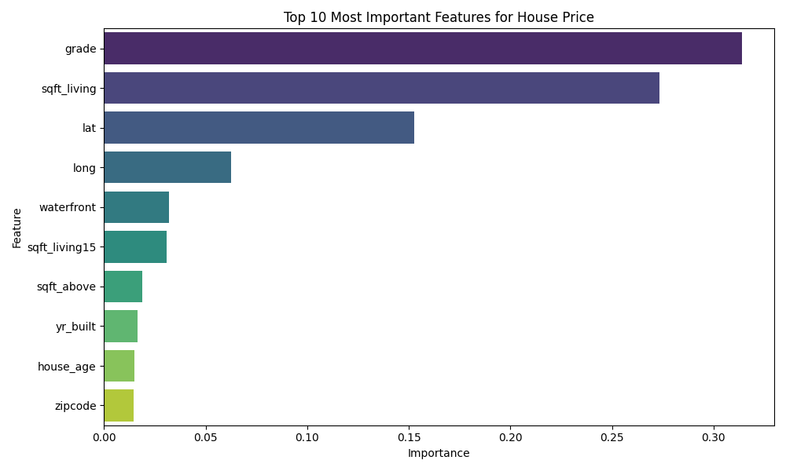
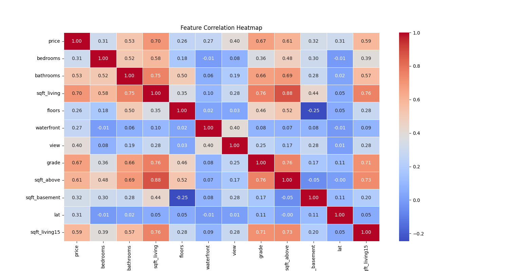

# House Price Prediction - King County (Seattle)

This project implements a **Machine Learning regression model** to predict housing prices in King County, USA. By analyzing features like living space, location, and property grade, the model achieves a high level of predictive accuracy.

## 📊 Performance Summary
- **Model:** Random Forest Regressor
- **R² Score:** 0.852
- **Mean Absolute Error (MAE):** ~$72,900
- **Key Insight:** Living square footage and property grade are the most significant predictors of house value.

## 🛠️ Project Structure
- `DATA/`: Contains the King County housing dataset.
- `SCRIPTS/`:
  - `01_eda_cleaning.py`: Data exploration, feature engineering, and correlation analysis.
  - `02_model_training.py`: Model pipeline including scaling and Random Forest training.
  - `03_model_evaluation.py`: Performance metrics and visualization of results.
- `OUTPUT_CHARTS/`: Saved visualizations (Heatmaps, Feature Importance, etc.).

## 🔬 Methodology
1. **Exploratory Data Analysis:** Analyzed correlations using heatmaps and handled outliers.
2. **Feature Engineering:** Created new features such as `house_age` to capture time-based trends.
3. **Model Selection:** Implemented a **Random Forest** algorithm, which outperformed standard linear models by capturing non-linear relationships.
4. **Validation:** Used an 80/20 train-test split and standard scaling for robust performance.
## 📈 Visualizing the Results

### Actual vs Predicted Prices
The following plot demonstrates the strong correlation between our model estimates and the real market values, confirming the R² score of 0.85.

### Feature Importance
This chart highlights the top factors driving house prices. Living space (sqft_living) and the overall grade of the house are the most influential variables.

### Correlation Heatmap
A look at how different variables relate to each other and to the final price.

---
*Developed as a Machine Learning portfolio project.*
